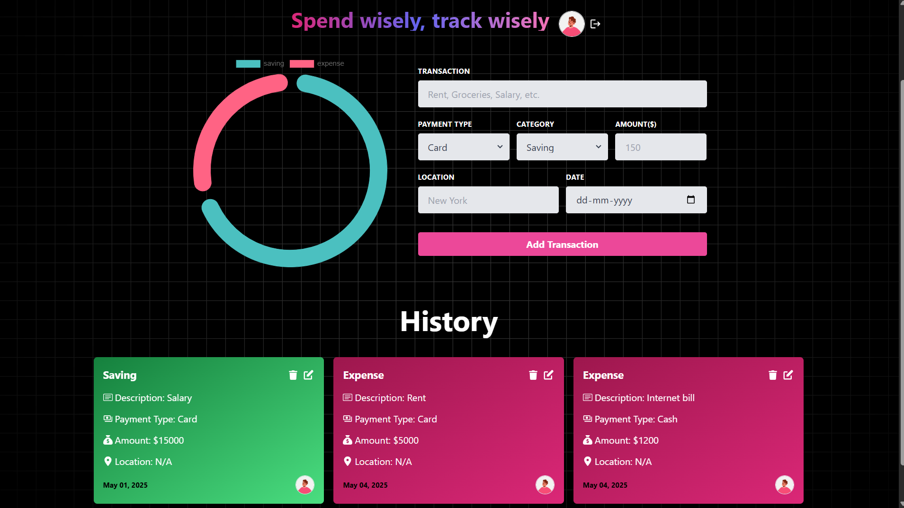

# 💸 Expense Tracker

A full-stack Expense Tracker web application built using:

-   🛠️ **Node.js + Express** (Backend)
-   📡 **GraphQL (Apollo Server)** (API)
-   ⚛️ **React (Vite)** (Frontend)
-   🎨 **Tailwind CSS** (Styling)
-   🚀 **Render** (Backend Deployment)

Track your personal or business expenses with a clean, modern UI and blazing-fast GraphQL-powered backend.

---

## 🚀 Live Demo

---

## ⚙️ Tech Stack

| Layer          | Stack                                |
| -------------- | ------------------------------------ |
| **Frontend**   | Vite + React + Tailwind CSS          |
| **Backend**    | Node.js + Express                    |
| **API**        | Apollo Server + GraphQL              |
| **State Mgmt** | Apollo Client + React Hooks          |
| **Hosting**    | Netlify (Frontend), Render (Backend) |

---

## 📸 Screenshots

| Dashboard                                 |
| ----------------------------------------- |
|  |

---
